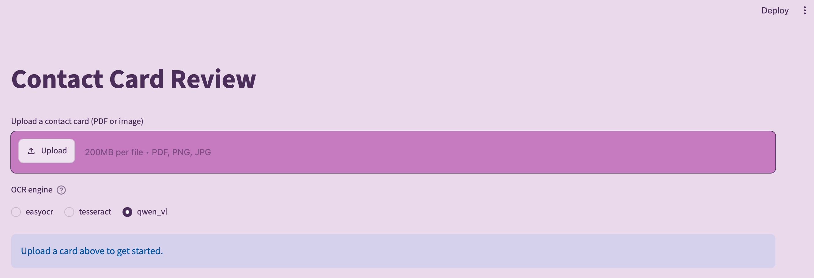

# Contact Card

A small tool that helps digitize handwritten and printed contact cards — upload a scan, extract the text with OCR, and review/correct the results before it gets used anywhere downstream.



## Background

This started as a proof-of-concept exploring how to reduce the manual effort of hand-entering ~100 contact cards a month, collected on paper at events. The cards are a mix of handwritten and printed text, which turns out to be a genuinely hard OCR problem — most tooling is built for clean, printed documents, not messy handwriting.

Since the source data is personal contact information, everything in this project runs **fully locally** — no cloud OCR APIs, no data leaving the machine.

## What it does

- Upload a card as a PDF or image, either through the **Streamlit review UI** or the **FastAPI `/extract` endpoint**
- Extracts text using one of three local engines (switchable in the UI, or passed as a parameter to the API):
  - **Tesseract** — fast, classical OCR, but struggles badly with handwriting
  - **EasyOCR** — deep-learning based, noticeably better on messy handwriting, though still far from perfect
  - **Qwen3-VL (4B)** — a local vision-language model, run via [LM Studio](https://lmstudio.ai), that reads the card using context rather than pure pattern-matching. Slower than the other two, but generally the most accurate on handwriting
- Displays each detected field next to the original image, editable, with a confidence score where available — so a human can quickly correct the model's guesses rather than trusting them blindly
- Warns rather than silently drops data if a multi-page PDF is uploaded (only the first page is currently processed)

## Why a review step, not just "better OCR"

Handwriting recognition on real, messy, inconsistent samples is unreliable, even with the strongest of the three approaches tested here. Rather than chasing higher accuracy indefinitely, this project treats human-in-the-loop review as a first-class part of the design — each engine gives a starting draft, a person confirms or fixes it.

## Comparing the three engines

| Engine | Speed | Handwriting accuracy | Setup |
|---|---|---|---|
| Tesseract | Fast | Poor | `brew install tesseract` |
| EasyOCR | Moderate | Fair, needs review | Installed via `uv sync` |
| Qwen3-VL (4B) | Slow (local hardware dependent) | Best of the three | Requires [LM Studio](https://lmstudio.ai) running locally with a Qwen3-VL model loaded |

This project was tested on an 8GB RAM machine — Qwen3-VL runs, but is noticeably slower than the other two, since local vision-LLM inference is memory- and compute-intensive. On lower-RAM machines it's realistic to expect it to take from tens of seconds up to a couple of minutes per card. Timing for each engine is logged to the console on every run.

## Tech stack

- [uv](https://docs.astral.sh/uv/) — dependency and environment management
- [ruff](https://docs.astral.sh/ruff/) — linting and formatting
- [mypy](https://mypy-lang.org/) — static type checking
- [pytest](https://docs.pytest.org/) — testing
- [Streamlit](https://streamlit.io/) — the review UI
- [FastAPI](https://fastapi.tiangolo.com/) — the `/extract` API endpoint
- [Tesseract](https://github.com/tesseract-ocr/tesseract) / [EasyOCR](https://github.com/JaidedAI/EasyOCR) — local OCR engines
- [Qwen3-VL](https://github.com/QwenLM/Qwen3-VL) via [LM Studio](https://lmstudio.ai) — local vision-language model

## Project structure

```
src/
├── api/            # FastAPI app and routes (POST /extract)
├── ingestion/       # OCR / extraction logic (Tesseract, EasyOCR, Qwen3-VL)
├── review/           # Streamlit review UI
└── cli/               # `contact-card` command-line entry point
tests/                  # pytest suite (dispatch logic + API validation)
```

## Getting started

**Requirements:**
- [uv](https://docs.astral.sh/uv/getting-started/installation/) installed
- [Tesseract](https://tesseract-ocr.github.io/tessdoc/Installation.html) available on your system (e.g. `brew install tesseract` on macOS), since `pytesseract` calls it as an external binary
- Optional, for the Qwen3-VL engine: [LM Studio](https://lmstudio.ai) installed, with a Qwen3-VL (4B recommended) model downloaded and its local server running

```bash
git clone https://github.com/aarondavis-git/ContactCard-OCR.git
cd ContactCard-OCR
cp .env.example .env    # adjust if your LM Studio setup differs from the defaults
uv sync
uv run contact-card
```

This launches the Streamlit review app in your browser. Upload a card, pick an engine, and see the extracted fields. If you select Qwen3-VL without LM Studio's server running, you'll see a clear error message rather than a crash.

To run the API instead:
```bash
uv run fastapi dev src/api/main.py
```
Then visit `http://127.0.0.1:8000/docs` for interactive API documentation.

## Configuration

LM Studio's URL and model name are read from environment variables (see `.env.example`), so they can be adjusted per machine without editing source code:
```
LOCAL_LLM_URL=http://localhost:1234/v1/chat/completions
LOCAL_LLM_MODEL_NAME=qwen3-vl-4b
```

## Development

```bash
uv run ruff check .      # lint
uv run mypy src/          # type check
uv run pytest               # run tests
```

All three run automatically in CI on every push.

## Known limitations

- OCR/extraction accuracy on handwriting is inconsistent across all three engines, especially Tesseract — this is expected and part of why the review step exists
- Only the first page of a multi-page PDF is processed (a warning is shown when this happens)
- Qwen3-VL requires a separate local application (LM Studio) to be running — it's not bundled or auto-started
- The fundraisingbox API integration (the original "make this actually save the contact somewhere" step) is not yet included in this version

## Possible next steps

- Map extracted text chunks to actual named fields (name, email, phone, address) instead of a flat list
- Try additional local OCR engines (e.g. PaddleOCR) for comparison
- Image preprocessing (deskew, contrast) to improve OCR input quality
- Wire up a fundraisingbox API client to submit confirmed data to a real backend
